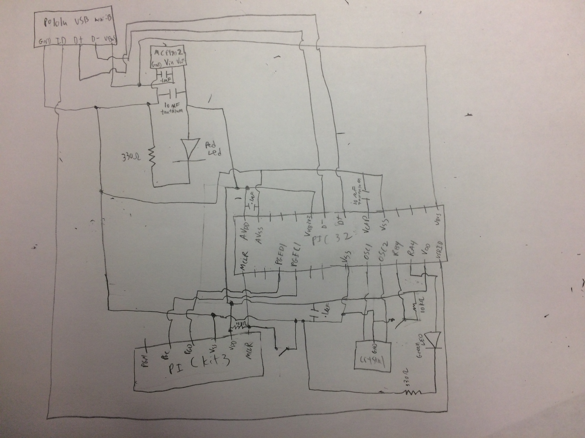
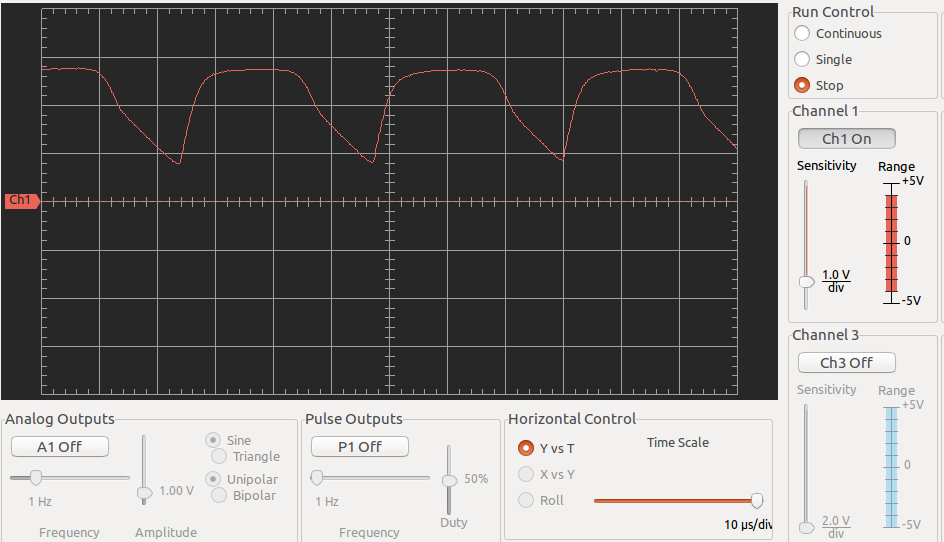
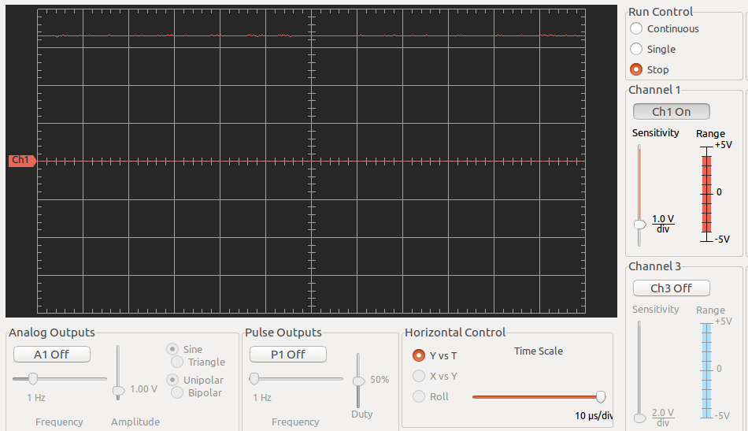
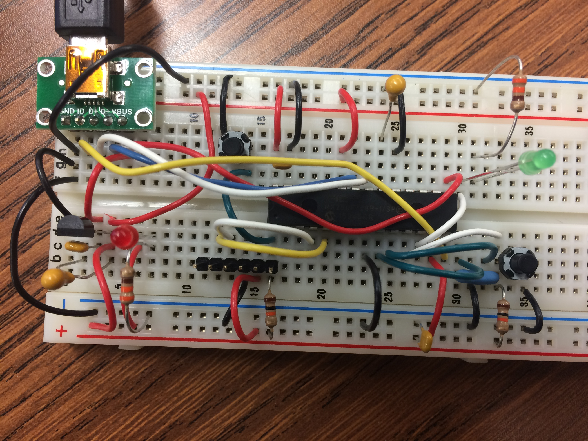

# ME-433 HW1
**Michael Wizniter**

1. Circuit Diagram can be seen below:

2. Without capacitors, the output on the oscilliscope looks like the following:

With capacitors, the output on the oscilliscope lookes like the following:

The wiring on the breadboards looks like the following:

