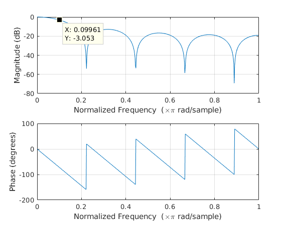
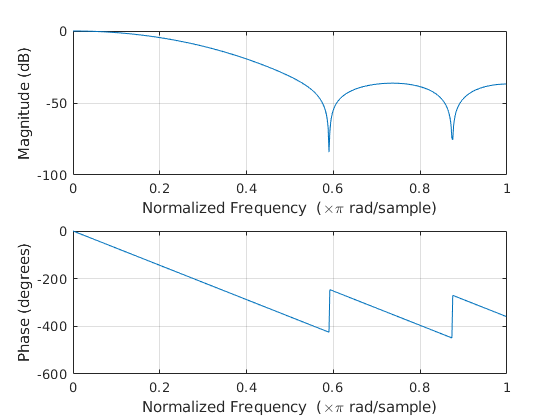
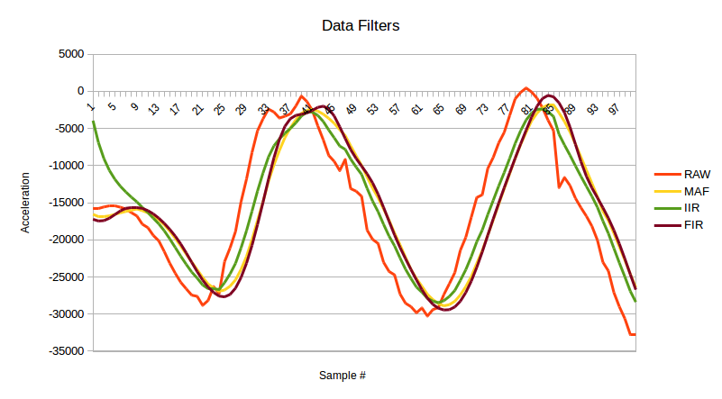

# ME-433 HW10
**Michael Wizniter**

1. MAF Filter

Used b = [1 1 1 1 1 1 1 1 1]/9 since this gave a cutoff frequency of near 5Hz.
This can be seen in the freqz plot below where 0.1 is at the 5Hz cutoff frequency
(at -3dB) given that 1 on the plot corresponds to half the 100Hz sampling rate.

2. IIR Filter

Used A = 0.75 and B = 0.25 since it makes sense to me that we would weight the accumulated
output value as higher overall than the new datapoint which could be noisy.

3. FIR Filter

Used Matlab command `fir1(8,0.1)` to produce a set of 9 weights that would occur
at a cufoff frequency at 5 Hz (which is at 0.1 as explained in #1). The plot is shown below.

4. Filter Data

The output plot of the filtered data is shown below. From the data, it can be seen that the
FIR filter seems to do the best in being smooth and close to the actual trend of the raw values.
They are all fairly good though.

