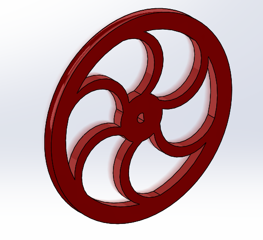
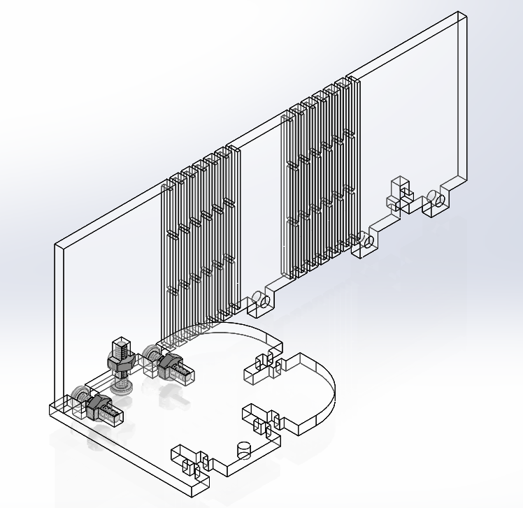

# ME-433 HW15
**Michael Wizniter**

1. Wheel Design and corresponding 3D printed part:

Wheel Design                            | 3D printed part
:--------------------------------------:|:--------------------------------------:
 | 

2. CAD Housing Assembly Pic and corresponding Laser Cut Assembly:

Housing Design                   | Laser Cut Assembly
:-------------------------------:|:----------------------------------------:
 |
